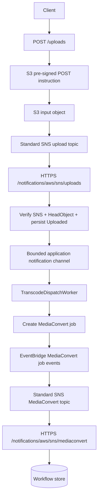
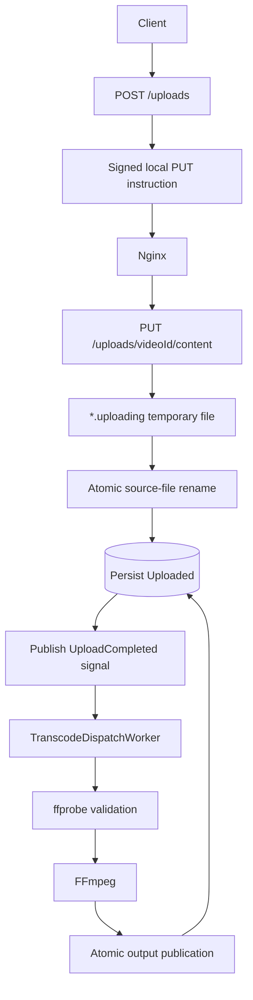

# Target Architecture

## AWS workflow



## On-premises workflow



## Shared design

Both workflows are adapted into:

```csharp
public sealed record UploadCompletedNotification(
    string NotificationId,
    string VideoId,
    UploadProviderKind UploadProvider,
    SourceLocator Source,
    DateTimeOffset OccurredAtUtc);
```

The SNS endpoint parses an S3 notification and produces this record. The local upload endpoint produces the same record after finalizing the file.

## Persistence is authoritative

The bounded channel is only a low-latency wake-up signal. The worker also scans the database:

```text
on startup
and every configured interval:
    claim workflows with status Uploaded
```

This resolves the failure window between persistent upload completion and channel publication.

## Provider abstractions

### Upload instruction

```csharp
public interface IUploadProvider
{
    UploadProviderKind Kind { get; }

    Task<UploadInstruction> CreateInstructionAsync(
        UploadSession session,
        CancellationToken cancellationToken);

    Task<SourceObjectMetadata> InspectAsync(
        VideoWorkflow workflow,
        CancellationToken cancellationToken);
}
```

Implementations:

- `S3PresignedPostUploadProvider`
- `LocalHttpUploadProvider`

### Notification publication

```csharp
public interface IUploadCompletedNotificationPublisher
{
    ValueTask PublishAsync(
        UploadCompletedNotification notification,
        CancellationToken cancellationToken);
}
```

Local implementation writes to a bounded `Channel<UploadCompletedNotification>`. AWS SNS messages are adapted by the HTTP endpoint and published to the same channel after persistent state is updated.

### Transcoding

```csharp
public interface ITranscodeProvider
{
    TranscodeProviderKind Kind { get; }

    Task<TranscodeStartResult> StartAsync(
        VideoWorkflow workflow,
        TranscodeProfile profile,
        CancellationToken cancellationToken);
}
```

Implementations:

- `MediaConvertTranscodeProvider`
- `FfmpegTranscodeProvider`

## State model

```text
UploadPending
Uploading
UploadRejected
Uploaded
Queued
Validating
Submitted
Transcoding
Completed
Failed
Canceled
Expired
```

Recommended transitions:

```text
UploadPending -> Uploading
UploadPending -> Uploaded        (S3 notification)
UploadPending -> UploadRejected
UploadPending -> Expired

Uploading -> Uploaded
Uploading -> UploadRejected
Uploading -> Failed

Uploaded -> Queued
Queued -> Validating
Validating -> Submitted          (MediaConvert)
Validating -> Transcoding        (FFmpeg)
Validating -> Failed

Submitted -> Transcoding
Submitted -> Completed
Submitted -> Failed
Submitted -> Canceled

Transcoding -> Completed
Transcoding -> Failed
Transcoding -> Canceled
```

## Idempotency

Use all of these:

1. `(topic_arn, sns_message_id)` unique notification key.
2. `(source_provider, source_identity)` unique source completion key.
3. Guarded transition from `Uploaded` to `Queued/Validating`.
4. One provider job per `(video_id, profile_name)`.
5. Stable MediaConvert `ClientRequestToken`.
6. Monotonic provider-event status handling.
7. Local token is one-time.
8. Recovery scans persistent state.

## SNS request behavior

The HTTPS endpoint should:

1. Read a small bounded request body.
2. Parse the SNS envelope.
3. Verify signature and certificate origin.
4. Check exact TopicArn.
5. Handle subscription confirmation.
6. Deduplicate message ID.
7. Parse the inner message.
8. Persist workflow changes.
9. Publish a local wake-up signal.
10. Return 2xx promptly.

Return 429 or 5xx only for transient conditions that should be retried. Treat permanent malformed or unauthorized input as a permanent client error.

## Endpoint exposure

Expose only narrow SNS paths through the public reverse proxy:

```text
/notifications/aws/sns/uploads
/notifications/aws/sns/mediaconvert
```

Do not expose internal status administration routes unnecessarily. Use a trusted public CA certificate and HTTPS.
